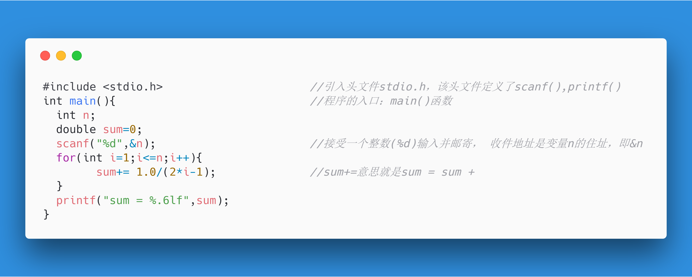
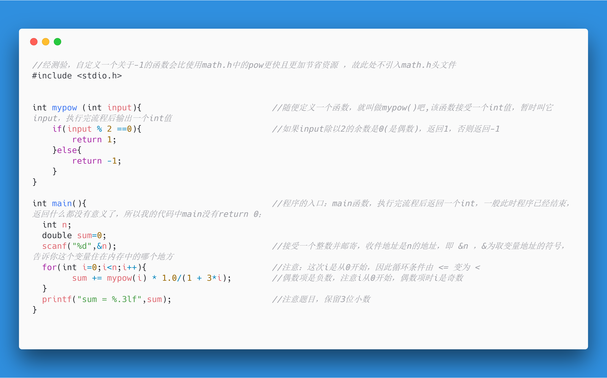
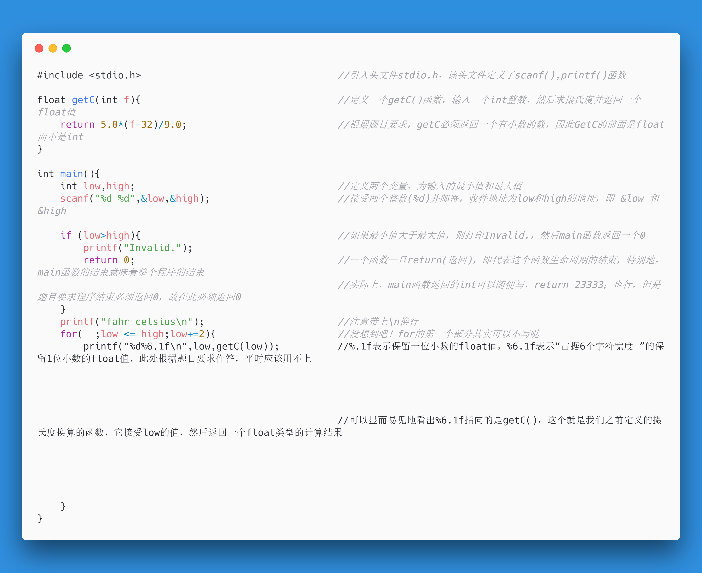
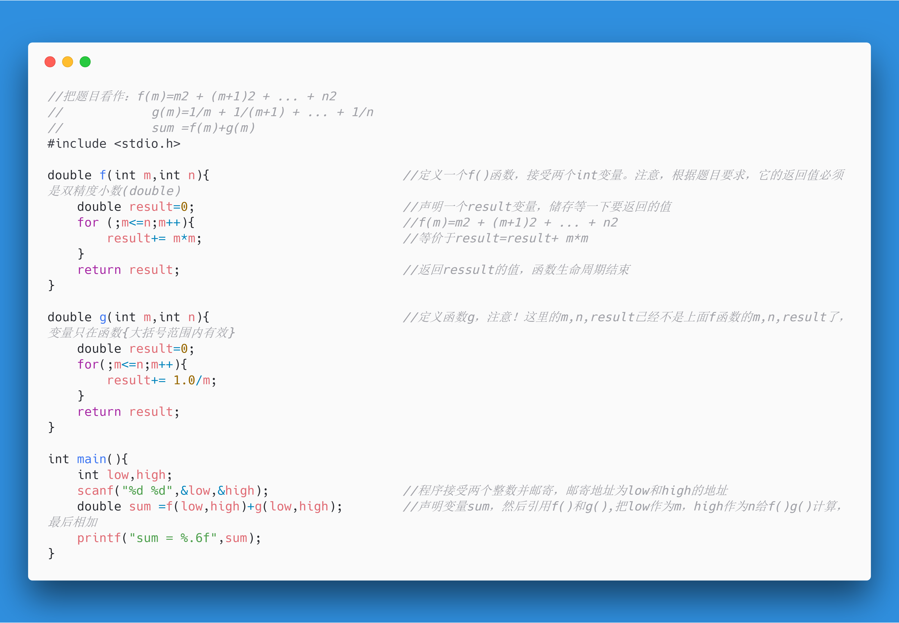

# 金陵科技学院-18数字媒体技术-实验2.3-指定次数循环
> 此文档及相关图片由程序自动生成

在上面的文件列表中点击相关文件名即可阅览/复制源代码
以下为图片阅览
### 7-1 求N分之一序列前N项和.c

### 7-2 求奇数分之一序列前N项和.c

### 7-3 求简单交错序列前N项和.c

### 7-4 输出华氏-摄氏温度转换表.c

### 7-5 求平方与倒数序列的部分和.c

