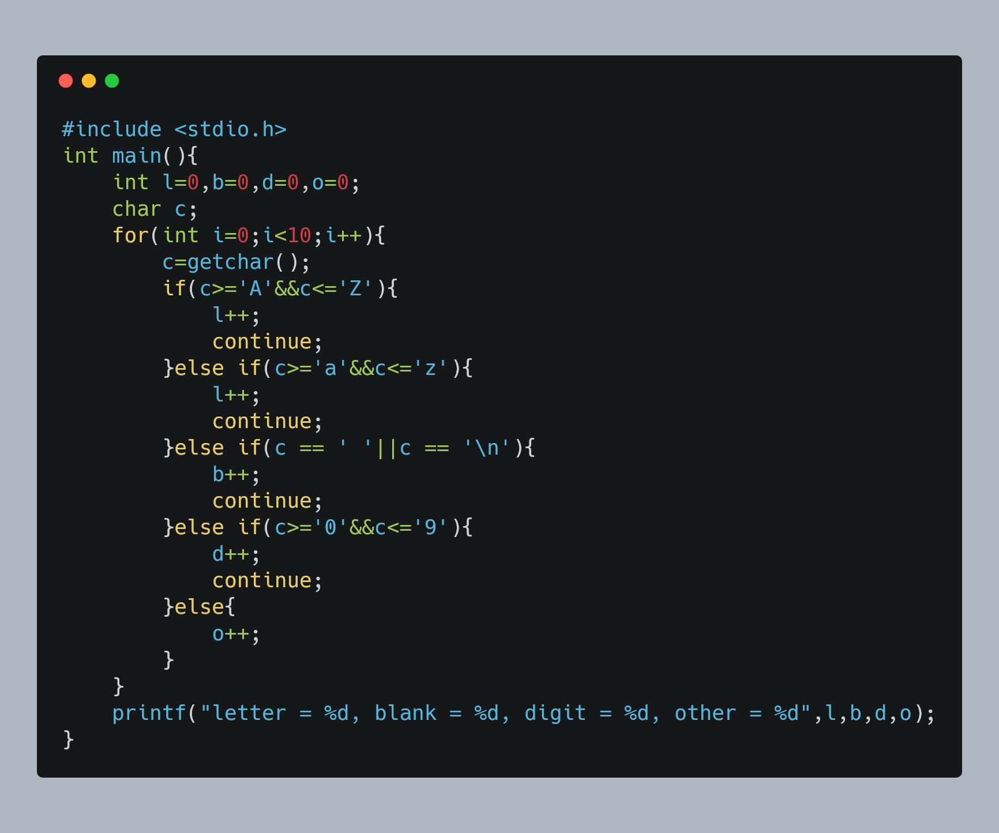

# 金陵科技学院-18数字媒体技术-实验3-分支结构程序设计
> 此文档及相关图片由程序自动生成

在上面的文件列表中点击相关文件名即可阅览/复制源代码
以下为图片阅览
### 7-1 计算符号函数的值.c

### 7-2 比较大小.c

### 7-3 两个数的简单计算器.c

### 7-4 统计字符.c

### 7-5 查询水果价格.c

### 7-6 输出三角形面积和周长.c

### 7-7 计算油费.c

### 7-8 输出闰年.c

