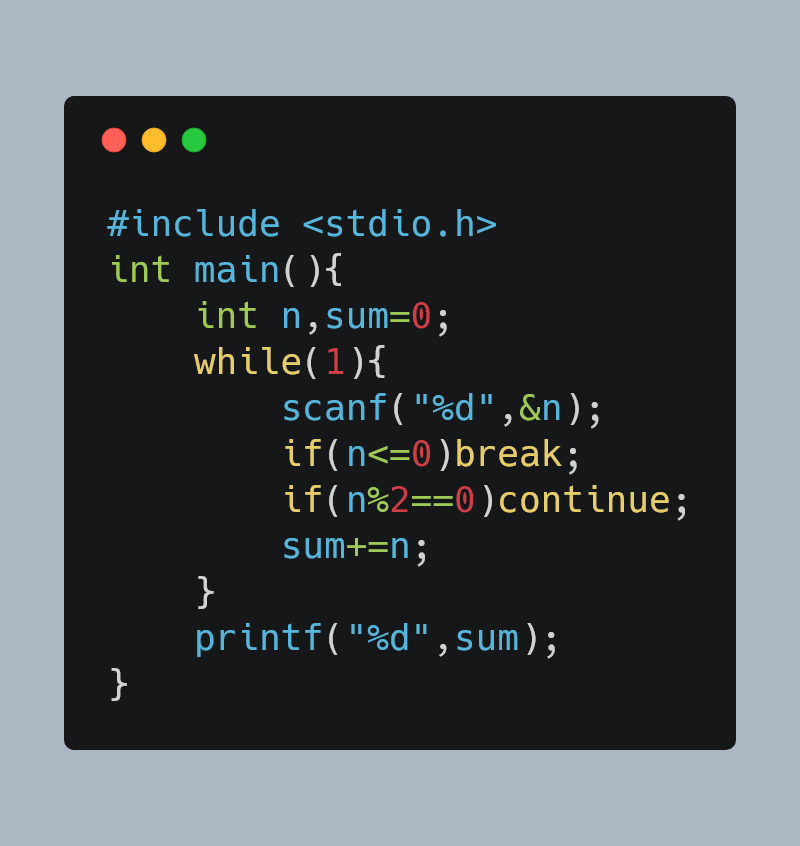
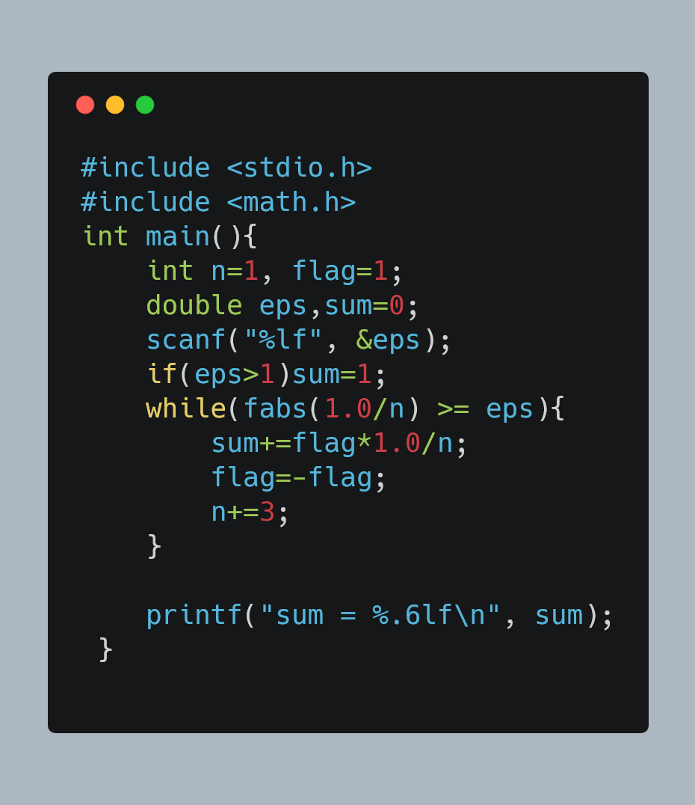
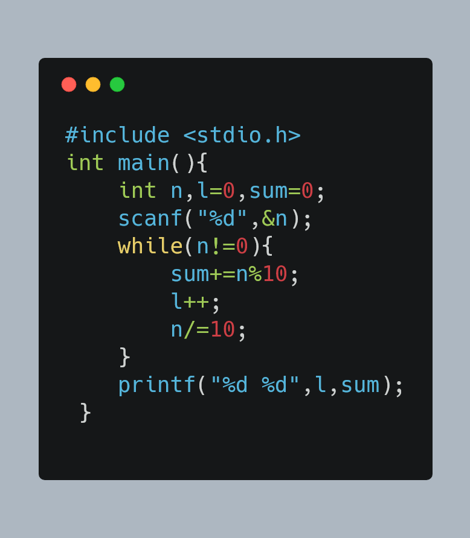
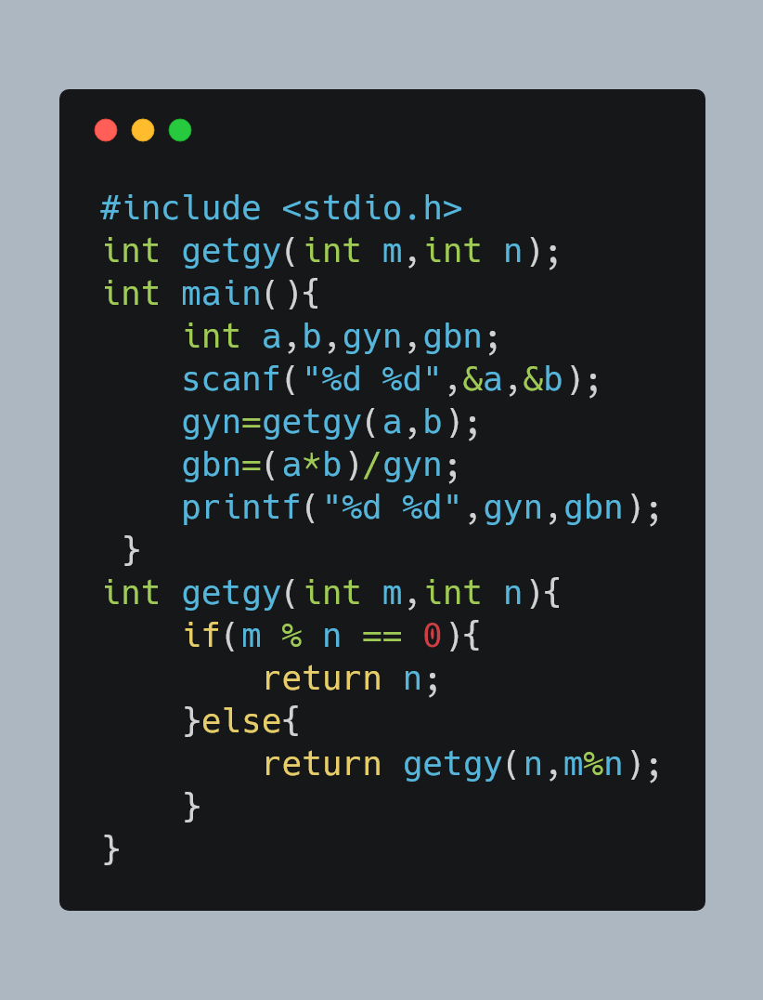
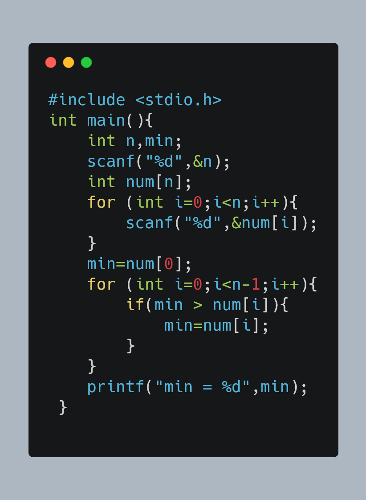
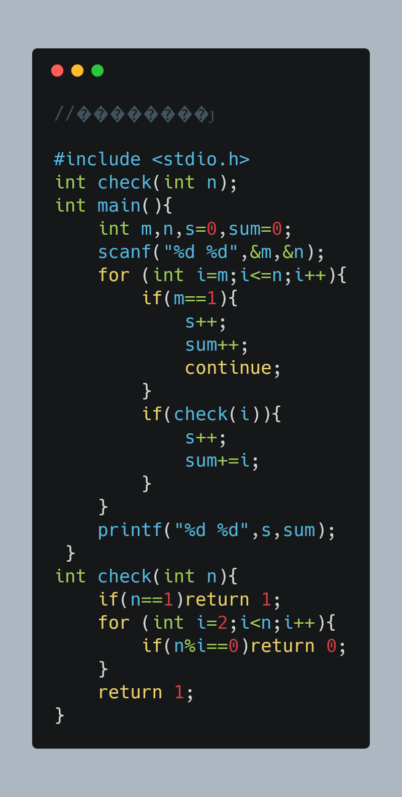

# 金陵科技学院-18数字媒体技术-实验4.1-基本循环语句的使用
> 此文档及相关图片由程序自动生成

在上面的文件列表中点击相关文件名即可阅览/复制源代码
以下为图片阅览
### 7-1 求奇数和.c

### 7-2 求给定精度的简单交错序列部分和.c

### 7-3 求整数的位数及各位数字之和.c

### 7-4 最大公约数和最小公倍数.c

### 7-5 找出最小值.c

### 7-6 统计素数并求和.c

